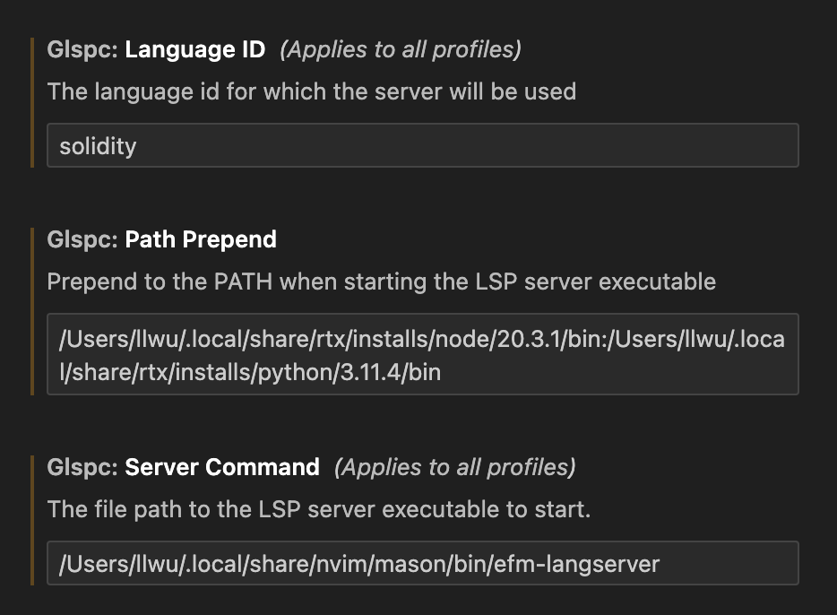

# Generic LSP Client for VSCode

This is a GitHub fork of torokati44's [GitLab repository](https://gitlab.com/torokati44/vscode-glspc) plus some fixes and updates.

Before using this, please search the repository of your LSP server for "vscode", since 99% of the time they already made a VSCode LSP client.

## Marketplace Link
[Generic LSP Client](https://marketplace.visualstudio.com/items?itemName=llllvvuu.llllvvuu-glspc)

## Configuration Example



## Multiple LSP Servers

This extension is not a process manager (yet), so to get clients for multiple LSP servers you need to build multiple copies of this extension:

```sh
vi package.json  # change the "name", "displayName", and "description" fields
                 # also find/replace "Generic LSP Client"
npm install
npm run package
```

Then you can load it into VSCode under Extensions > ... > Install from VSIX...

## See Also
* [mattn/efm-langserver](https://github.com/mattn/efm-langserver) - Adapter for any command-line tool to LSP.
* [llllvvuu/efm-tool-definitions.yaml](https://github.com/llllvvuu/efm-tool-definitions.yaml) - Configuration presets for the above.
